# Stuff Happens? - Web Application


## Project Description

The application is a single-player web version of the board game "Stuff Happens", based on the Sport & Fitness theme , developed as a Single Page Application (SPA) using **React**, **Node.js**, **Express**, and **SQLite**.

The goal of the game is to collect 6 cards, each representing an unfortunate or unlucky situation related to sports and physical activity. Every card contains a name, a representative image, and a unique misfortune index from 1 to 100.

### Game Mode

At the beginning of a game, the player receives 3 random cards, generated by the server and sorted by their misfortune index.

During each round, a new situation is presented to the player. Only the name and image of the situation are shown, while its misfortune index remains hidden. The player must determine where the new card should be placed relative to the cards they already own.

The player has 30 seconds to make a choice:

if the correct position is selected, the card is added to the player's collection and all of its information is revealed;
if the position is incorrect or the time runs out, the card is not added and its misfortune index remains hidden;
a card that has already been used during the game will not be presented again in subsequent rounds.

The game ends when the player:

collects 6 cards, winning the game;
makes 3 incorrect guesses, losing the game.

At the end of the game, a summary is displayed showing all the cards owned by the player, including their name, image, and misfortune index.

### Users

The application supports two types of users.

#### Anonymous Users

Visitors can view the game instructions and play a one-round demo game, starting with the 3 initial cards.

Anonymous users do not have access to the features reserved for registered users.

#### Registered Users

Authenticated users can play complete games and view a history of completed games on their profile, sorted by date.

For each game, the history displays:

the situations involved in the game;
the cards received at the beginning of the game;
the cards that were won and those that were not obtained;
the round in which each card was played;
the final result of the game;
the total number of cards collected.

# Running the Project

## Prerequisites

Make sure you have installed:

* Node.js (v18 or later recommended)
* npm
* nodemon (globally installed)

## Installation

Clone the repository and install the dependencies for both the server and the client.

### Server

```bash
cd server
npm install
```

### Client

```bash
cd client
npm install
```

## Start the Application

Open two terminals.

### Terminal 1 - Start the server

```bash
cd server
nodemon index.mjs
```

The server will run on **http://localhost:3001**.

### Terminal 2 - Start the React client

```bash
cd client
npm run dev
```

The client will run on **http://localhost:5173** (default Vite port).

Open the URL shown by Vite in your browser to use the application.

## Login Credentials

| Username | Password |
| --- | --- |
| utente1@gmail.com | Password1 |
| utente2@gmail.com | Password2 |
| utente3@gmail.com | Password3 |

# React Client Application Routes

| Route | Description |
| --- | --- |
| `/` | The landing page is the first page users see. Its purpose is to direct the user toward two possible flows: the Demo button takes you to `/demo`, while the Login button takes you to `/login`. |
| `/demo` | Introduces the demo version of the application, displays its main rules, and offers a Cancel button to return to `/` or a button to start the demo at `/demo/game`. |
| `/demo/game` | Allows the user to play a demo game. At the end of the demo round, a button redirects the user back to `/demo`. |
| `/login` | Contains the login form. A successful login redirects to `/home`. A Cancel button returns the user to `/`. |
| `/home` | Shows the logged-in user's game rules. It provides navigation to the user profile at `/home/userProfile`, to a new game at `/home/game` and a Logout action returning to `/login`. |
| `/home/game` | The page where the logged-in user plays the game and can exit after completing it. |
| `/home/userProfile` | Allows logged-in users to view their username and game history. It also provides navigation back to `/home`. |

# API Server

| Method | Route | Description |
| --- | --- | --- |
| GET | `/api/cards/:cardId` | Retrieves a card by its ID. |
| GET | `/api/randomCard?excluded` | Retrieves a random card, excluding cards already drawn. |
| GET | `/api/users/:userId/games` | Retrieves all games played by a user. |
| GET | `/api/games/:gameId` | Retrieves a game by its ID. |
| GET | `/api/games/:gameId/cards` | Retrieves all cards played in a game. |
| POST | `/api/games/add` | Creates a new game. |
| POST | `/api/cardsGame/add` | Adds a card to a game. |
| PUT | `/api/games/:gameId/update` | Updates the `cardsWon` and `completed` fields of a game. |
| POST | `/api/session` | Logs a user in. |
| DELETE | `/api/sessions/current` | Logs the current user out. |

## Database Tables

### Database Schema

- Table `users` – Stores registered user credentials.
  - `id` – Unique identifier for each user (primary key).
  - `username` – The name used by the user to log in.
  - `password` – Hashed password of the user.
  - `salt` – Salt used for password hashing.

- Table `cards` – Contains all possible "horrible situation" cards.
  - `id` – Unique identifier for each card (primary key).
  - `name` – Short description of the situation.
  - `index` – A unique value (1–100) indicating how bad the situation is.
  - `imageURL` – path to an image representing the situation.

- Table `games` – Stores completed games played by users.
  - `id` – Unique identifier for each game (primary key).
  - `userId` – Reference to the user who played the game (`users.id`).
  - `date` – Timestamp of when the game started.
  - `cardsWon` – Number of cards successfully won during the game (used to determine win/loss).
  - `completed` –  Indicates whether the game was finished or abandoned (0 = abandoned , 1 = finished)

- Table `cardsGame` – Links cards to a specific game and tracks their outcome.
  - `id` – Unique identifier for the entry (primary key).
  - `gameId` – Reference to the game (`games.id`).
  - `cardId` – Reference to the card involved in the game (`cards.id`).
  - `round` – Round number in which the card was played (0 for initial cards).
  - `result` – Status of the card in the game ( -1 = initial card , 0 = played and lost , 1 = played and won).

## Technologies Used

- **Client:** React, Vite, React Router, React Bootstrap, Bootstrap Icons, and Day.js.
- **Server:** Node.js, Express, Passport.js, `express-session`, `express-validator`, CORS, and Morgan.
- **Database:** SQLite3.

## Screenshots

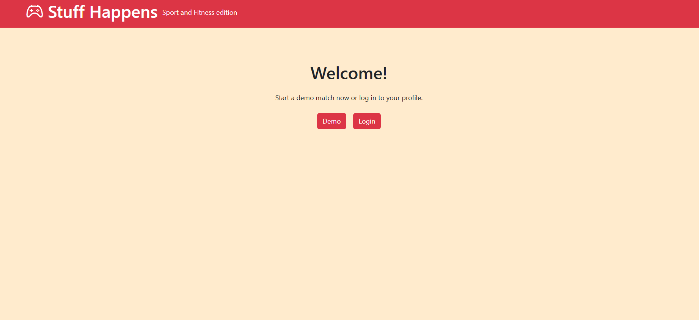

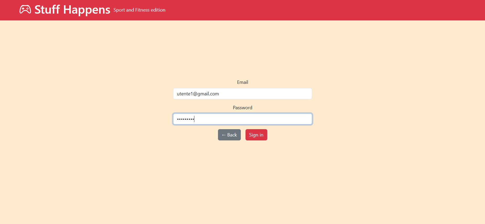

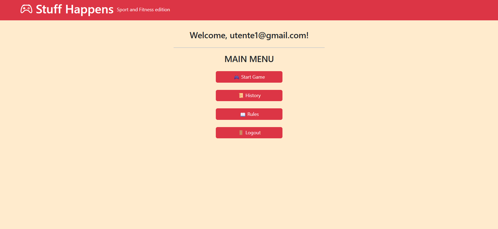

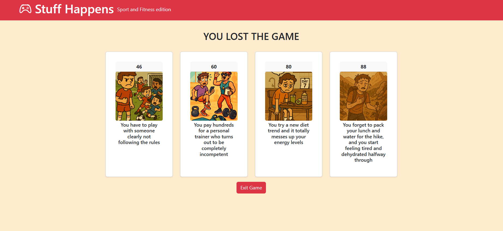

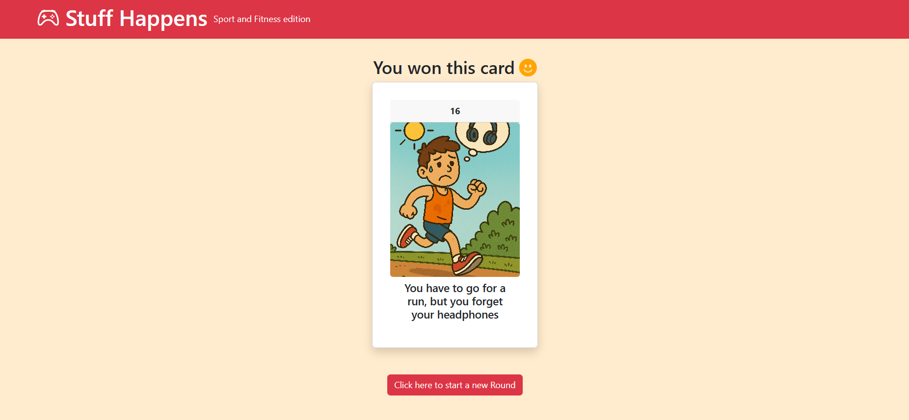

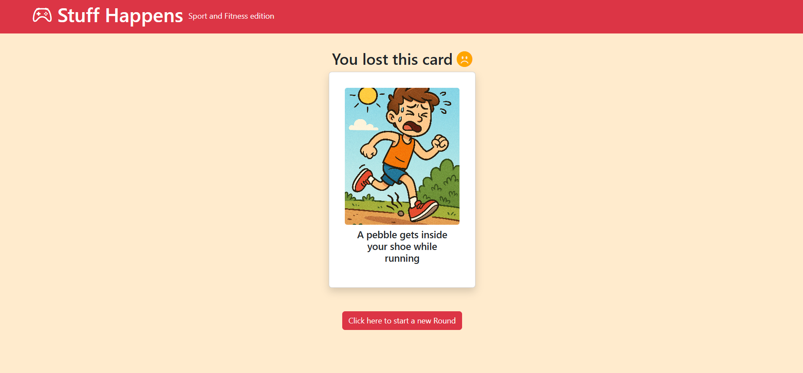

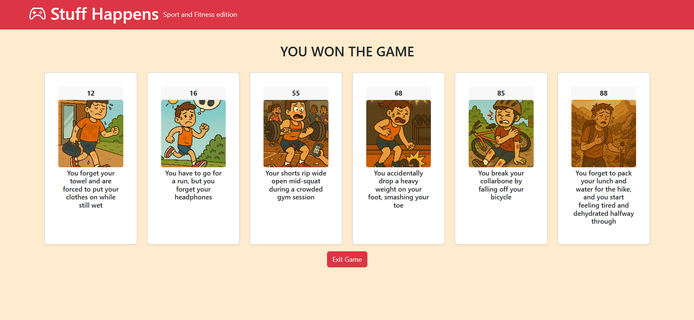

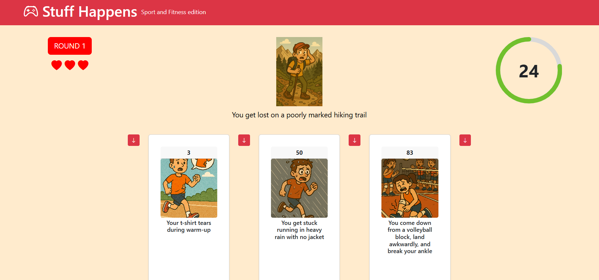

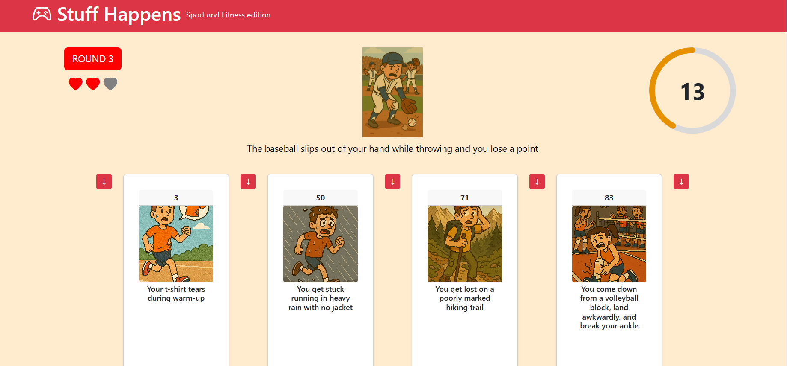

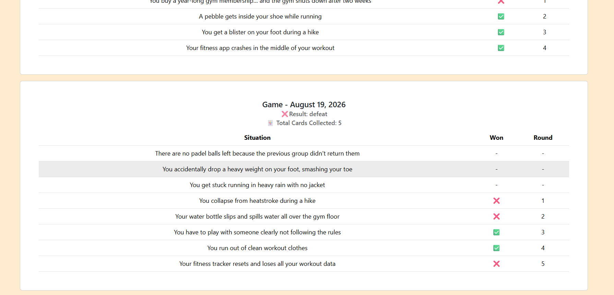

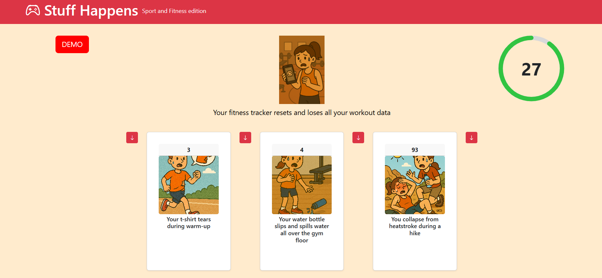

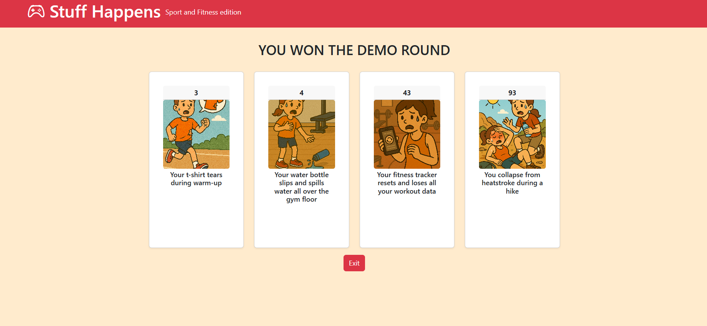


# Disclaimer:
The illustrations used on the cards in this project were generated with ChatGPT for educational purposes.
